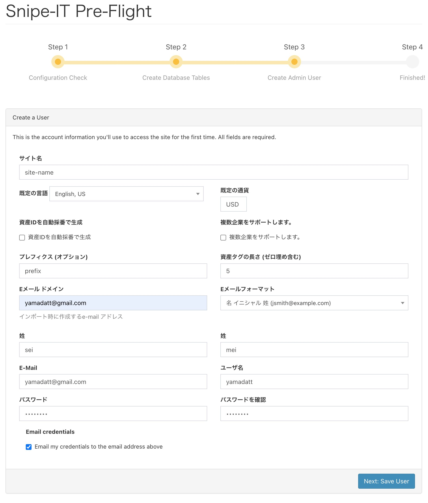

- [1. 手順](#1-手順)
  - [1.1. .envの変更](#11-envの変更)
  - [1.2. snape-itの起動](#12-snape-itの起動)
  - [1.3. snape-itへのアタッチ](#13-snape-itへのアタッチ)
  - [1.4. API-KEYの発行](#14-api-keyの発行)
  - [1.5. .envの変更](#15-envの変更)
  - [1.6. 再起動](#16-再起動)
  - [1.7. ブラウザでアクセス](#17-ブラウザでアクセス)


## 1. 手順

### 1.1. .envの変更

環境にあったURLに書き換える。

```
APP_URL=http://192.168.1.78:8080/
```

### 1.2. snape-itの起動

```bash
docker-compose up -d
```
### 1.3. snape-itへのアタッチ

```bash
docker exec -i -t snipe-it-app bash
```

### 1.4. API-KEYの発行

```bash
php artisan key:generate --show
```
### 1.5. .envの変更

上記で発行されたAPI-KEYに書き換える。

```bash
APP_KEY=base64:It3Z9qRN8LFRlijzCYFSZmbYrL9khPVjCsIUQFyuyl8=
```

### 1.6. 再起動

再起動する。

```bash
docker-compose restart
```

### 1.7. ブラウザでアクセス

ブラウザで以下にアクセスする。

```
http://<<EC2のIPアドレス>>:8080
```

以下の画面が出たら右下の[New:Create Database Tables]を押す。


以下のようなエラーが出たら、ブラウザバックで戻り、[New:Create Database Tables]を押す。


[New:Create User]を押す。


必要な項目を入力して[Next:Save User]を押す。



ダッシュボードが表示される。


